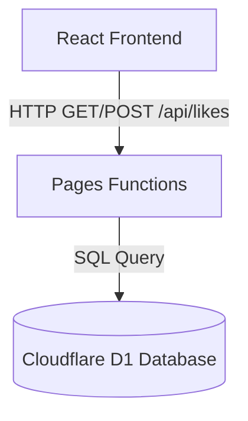

# sora-gallery いいね機能（Likes）要件定義・仕様書

## 1. 概要
`sora-gallery` に公開されている各動画に対し、ユーザーが「いいね（Like）」を送信・表示できる機能を追加する。
初期リリースである完全静的サイトの構成を活かしつつ、Cloudflareエコシステムを活用したミニマムかつスケーラブルなサーバーレス構成（Cloudflare Pages Functions + Cloudflare D1）を採用する。

## 2. システム構成・アーキテクチャ

### 2.1 全体構造
Vite + Reactで構成された静的SPAから、同一リポジトリ内の `/functions` ディレクトリ配下に定義したサーバーレスAPI（Pages Functions）を介して、SQLiteベースのマネージドデータベースである Cloudflare D1 にアクセスする。



### 2.2 採用理由
*   **ゼロ・インフラ管理**: D1もPages Functionsもサーバーレスであり、インフラの維持管理コスト（運用手間・サーバー費用）がほぼゼロ。
*   **単一リポジトリ管理**: API（`/functions`）を `sora-gallery` のフロントエンドと同じリポジトリで管理・自動デプロイできるため、開発・検証が非常に容易。
*   **安定IDの活用**: すでに動画データ（`public/videos.json`）に定義されている `id`（UUID/ULIDベースの公開用安定ID）をそのままデータベースの主キー（`video_id`）として使用できる。

---

## 3. データベース設計（Cloudflare D1）

D1 内に動画ごとのいいね数を記録する非常にシンプルなテーブルを構築する。

### 3.1 `likes` テーブル

| カラム名 | 型 | 制約 | 説明 |
| :--- | :--- | :--- | :--- |
| `video_id` | `TEXT` | `PRIMARY KEY` | 動画の公開ID（`videos.json` の `id` と一致） |
| `count` | `INTEGER` | `NOT NULL`, `DEFAULT 0` | 累積いいね数 |
| `updated_at` | `TEXT` | `NOT NULL` | 最終更新日時（ISO 8601 形式） |

---

## 4. APIエンドポイント設計（Cloudflare Pages Functions）

`/functions/api/likes.ts` に実装し、以下の2つのエンドポイントを公開する。

### 4.1 `GET /api/likes`
全動画のいいね数を一括で取得する。

*   **リクエストパラメータ**: なし（または特定動画IDのみを取得する場合は `?id=xxx`）
*   **レスポンス例 (JSON)**:
    ```json
    {
      "likes": {
        "video-id-12345": 42,
        "video-id-67890": 105
      }
    }
    ```
*   **処理ロジック**:
    1.  D1の `likes` テーブルから全レコードを取得。
    2.  `{ [video_id]: count }` のマップ形式に整形して返却（クライアント側のマッピングを容易にするため）。

### 4.2 `POST /api/likes`
特定の動画に対していいねを `+1` する。

*   **リクエストボディ (JSON)**:
    ```json
    {
      "video_id": "video-id-12345"
    }
    ```
*   **レスポンス例 (JSON)**:
    ```json
    {
      "success": true,
      "video_id": "video-id-12345",
      "new_count": 43
    }
    ```
*   **処理ロジック**:
    1.  リクエストボディの `video_id` が存在し、文字列であるか検証。
    2.  同一IPアドレスからの短時間での連打を防ぐための「簡易レートリミット」（後述）を適用。
    3.  SQLの `INSERT ... ON CONFLICT(video_id) DO UPDATE` (Upsert句) を実行し、カウントを `+1` する。
        ```sql
        INSERT INTO likes (video_id, count, updated_at)
        VALUES (?1, 1, datetime('now'))
        ON CONFLICT(video_id) DO UPDATE SET
          count = count + 1,
          updated_at = datetime('now');
        ```
    4.  更新後の最新の `count` を取得して返却。

---

## 5. スパム・二重投票対策（セキュリティ）

一般公開サイトにおける「無限連打」や「スクリプトによるスパム」を防ぐため、以下の多層防御アプローチを採用する。

### 5.1 クライアントサイド：LocalStorageによる制御（難易度：極低）
*   ユーザーが特定の動画にいいねを送信した際、ブラウザの `LocalStorage` に `{ sora_liked_videos: ["id1", "id2"] }` という形で保存する。
*   すでにいいね済みの動画については、UI上のいいねボタンを「アクティブ（ハートが塗りつぶされた状態）」にし、**ボタンを無効化（クリック不可）**にする。
*   ※注意: ブラウザのキャッシュクリアやシークレットウィンドウで突破可能だが、一般ユーザーの誤操作や連打を最も手軽に防止できる。

### 5.2 サーバーサイド：IPアドレスによる簡易レートリミット（難易度：低）
*   Pages Functions 内でリクエスト元のIPアドレス（`request.headers.get("CF-Connecting-IP")`）を取得。
*   同一IPからの短時間での連続リクエスト（例: 1秒間に3回以上のPOST）があった場合、ステータスコード `429 Too Many Requests` を返却する。
*   ※注意: Cloudflare Pages はエッジで実行されるため、IPごとの一時的なリクエスト数をインメモリ（または短時間のキャッシュ）で制限する。

---

## 6. フロントエンド UI/UX 設計

既存の美しいダークテーマ・グラスUIに調和するデザインを構築する。

### 6.1 配置箇所
*   **再生画面（個別動画のモーダル/オーバーレイ）**:
    *   prompt 表示エリアまたはコントロールバーの付近に配置する。
    *   デザイン: グラスモルフィズム調の角丸ボタンの中に、アウトラインのハートマーク ＋ カウント数を表示。
    *   いいね完了時: ハートが滑らかなアニメーション（少し弾けるようなスケールアップ）を伴って赤/ピンクに塗りつぶされ、カウント数が `+1` される。
*   **一覧画面（動画カード上）**:
    *   **要件定義 (docs/sora_gallery_requirements.md)** に従い、初期表示カードのシンプルさを保つため、**一覧のカード上にはいいね数・ボタンは配置しない**（ホバー時なども含め非表示）。

### 6.2 インタラクション・マイクロアニメーション
*   ホバー時: ボタンの背景（`bg-white/10`）が少し明るくなり、ハートマークがわずかに拡大。
*   クリック時: ハートに `scale-125` のようなバウンスアニメーションを適用し、直感的な心地よさを演出。
*   一度いいねした後は、ボタンをホバーしても「いいね済み」としてカーソルを `cursor-default` にし、視覚的にこれ以上押せないことを伝える。

---

## 7. 開発・テスト・検証計画

### 7.1 ローカル開発環境の構築
*   `wrangler pages dev` コマンドを使用することで、ローカルで Pages Functions および D1 データベースをエミュレートした状態で起動できる。
*   Wranglerのローカルデータベースはローカルディスクに保存されるため、フロントエンドとAPIの結合テストがローカルだけで完結する。

### 7.2 移行・デプロイ手順
1.  **D1データベースの作成**:
    ```bash
    npx wrangler d1 create sora-gallery-likes-db
    ```
2.  **テーブル初期化用SQLの実行**:
    ローカルおよび本番環境のD1に対して、テーブル作成スキーマを適用する。
3.  **Pagesプロジェクトへのバインド**:
    Cloudflareダッシュボードまたは `wrangler.toml` (もしくは設定) から、作成したD1データベースを `DB` というバインディング名で Pages に紐付ける。
4.  **デプロイ**:
    通常通り Cloudflare Pages にデプロイすると、`/functions` が自動ビルド・デプロイされ、APIとして機能する。
