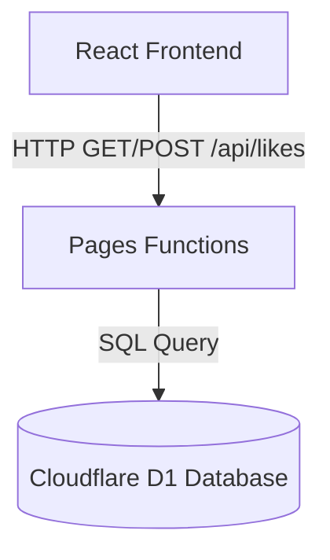

# sora-gallery いいね機能（Likes）要件定義・仕様書

## 1. 概要
`sora-gallery` に公開されている各動画に対し、ユーザーが「いいね（Like）」を送信・表示できる機能を追加する。
静的ギャラリーを基本とする構成を保ちつつ、Cloudflareエコシステムを活用したミニマムかつスケーラブルなサーバーレス構成（Cloudflare Pages Functions + Cloudflare D1）を採用する。

## 2. システム構成・アーキテクチャ

### 2.1 全体構造
Vite + Reactで構成された静的SPAから、同一リポジトリ内の `/functions` ディレクトリ配下に定義したサーバーレスAPI（Pages Functions）を介して、SQLiteベースのマネージドデータベースである Cloudflare D1 にアクセスする。



### 2.2 採用理由
*   **ゼロ・インフラ管理**: D1もPages Functionsもサーバーレスであり、インフラの維持管理コスト（運用手間・サーバー費用）がほぼゼロ。
*   **単一リポジトリ管理**: API（`/functions`）を `sora-gallery` のフロントエンドと同じリポジトリで管理・自動デプロイできるため、開発・検証が非常に容易。
*   **安定IDの活用**: すでに動画データ（`public/videos.json`）に定義されている `id`（UUID/ULIDベースの公開用安定ID）をそのままデータベースの主キー（`video_id`）として使用できる。

---

## 3. データベース設計（Cloudflare D1）

D1 内に動画ごとのいいね数を記録する非常にシンプルなテーブルを構築する。

### 3.1 `likes` テーブル

| カラム名 | 型 | 制約 | 説明 |
| :--- | :--- | :--- | :--- |
| `video_id` | `TEXT` | `PRIMARY KEY` | 動画の公開ID（`videos.json` の `id` と一致） |
| `count` | `INTEGER` | `NOT NULL`, `DEFAULT 0` | 累積いいね数 |
| `updated_at` | `TEXT` | `NOT NULL` | 最終更新日時（ISO 8601 形式） |

---

## 4. APIエンドポイント設計（Cloudflare Pages Functions）

`/functions/api/likes.ts` に実装し、以下の2つのエンドポイントを公開する。

### 4.1 `GET /api/likes`
全動画のいいね数を一括で取得する。

*   **リクエストパラメータ**: なし（または特定動画IDのみを取得する場合は `?id=xxx`）
*   **レスポンス例 (JSON)**:
    ```json
    {
      "likes": {
        "video-id-12345": 42,
        "video-id-67890": 105
      }
    }
    ```
*   **処理ロジック**:
    1.  `public/videos.json` から現在公開中の動画ID一覧を読み込む。
    2.  D1の `likes` テーブルから全レコードを取得。
    3.  現在公開中の動画IDに一致するレコードだけを `{ [video_id]: count }` のマップ形式に整形して返却する。
    4.  存在しない動画、非公開化済み動画、削除済み動画の likes はレスポンスに含めない。

### 4.2 `POST /api/likes`
特定の動画に対していいねを `+1` する。

*   **リクエストボディ (JSON)**:
    ```json
    {
      "video_id": "video-id-12345",
      "action": "like"
    }
    ```
    `action` は `"like"` または `"unlike"` とする。省略時は互換性のため `"like"` として扱う。
*   **レスポンス例 (JSON)**:
    ```json
    {
      "success": true,
      "action": "like",
      "video_id": "video-id-12345",
      "new_count": 43
    }
    ```
*   **処理ロジック**:
    1.  リクエストボディの `video_id` が存在し、公開IDとして許可する文字種・長さであるか検証する。
    2.  `public/videos.json` の現在公開中動画IDに含まれることを検証する。
    3.  `action` が `"like"` または `"unlike"` であることを検証する。省略時は `"like"` とする。
    4.  `"like"` の場合のみ、同一IPアドレスからの短時間での連打を防ぐための「簡易レートリミット」（後述）を適用する。
    5.  `"like"` の場合は SQLの `INSERT ... ON CONFLICT(video_id) DO UPDATE` (Upsert句) を実行し、カウントを `+1` する。
        ```sql
        INSERT INTO likes (video_id, count, updated_at)
        VALUES (?1, 1, datetime('now'))
        ON CONFLICT(video_id) DO UPDATE SET
          count = count + 1,
          updated_at = datetime('now');
        ```
    6.  `"unlike"` の場合は count を `-1` する。ただし `0` 未満にはしない。
        ```sql
        UPDATE likes
        SET count = max(count - 1, 0),
            updated_at = datetime('now')
        WHERE video_id = ?1;
        ```
    7.  更新後の最新の `count` を取得して返却。

`video_id` が `public/videos.json` に存在しない場合は `404` を返し、D1 には行を作らない。これにより、存在しない動画、非公開化済み動画、削除済み動画への likes 書き込みを防ぐ。

いいね済み状態はブラウザの LocalStorage に保存する。LocalStorage に対象動画 ID が残っている場合、ユーザーはもう一度ボタンを押して `action: "unlike"` を送信し、いいねを取り消せる。LocalStorage が消えた場合、サーバー側にはユーザー別の履歴がないため、そのブラウザでは過去のいいねを取り消せないものとして扱う。

---

## 5. スパム・二重投票対策（セキュリティ）

一般公開サイトにおける誤操作や軽い連打を抑えるため、以下の暫定的な多層防御アプローチを採用する。

この段階の対策はベストエフォートであり、悪意あるスクリプトや分散アクセスを完全に防ぐものではない。likes は公開サイトの軽量な反応機能として扱い、厳密な投票・ランキング・課金・審査の根拠には使わない。

### 5.1 クライアントサイド：LocalStorageによる liked cache（難易度：極低）
*   ユーザーが特定の動画にいいねを送信した際、ブラウザの `LocalStorage` に `{ sora_liked_videos: ["id1", "id2"] }` という形で保存する。
*   すでにいいね済みの動画については、UI上のいいねボタンを「アクティブ（ハートが塗りつぶされた状態）」にし、もう一度押すと取り消しとして扱う。
*   取り消しに成功したら、対象動画 ID を `LocalStorage` から削除する。
*   ※注意: ブラウザのキャッシュクリアやシークレットウィンドウでは liked cache が消える。この場合、サーバー側では本人の過去 like を判定できないため、取り消しは諦める。

### 5.2 サーバーサイド：IPアドレスによる暫定簡易レートリミット（難易度：低）
*   Pages Functions 内でリクエスト元のIPアドレス（`request.headers.get("CF-Connecting-IP")`）を取得。
*   `"like"` の同一IPからの短時間での連続リクエストがあった場合、ステータスコード `429 Too Many Requests` を返却する。
*   `"unlike"` は「押してすぐ戻す」操作を妨げないため、Pages Functions 内の簡易レート制限対象外とする。
*   この制御は Pages Functions の実行インスタンス内メモリを使うため、エッジ全体で一貫した制限にはならない。
*   同一IP/NAT配下の別ユーザーを巻き込む可能性がある一方、別IPや別インスタンスからのアクセスは止めきれない。
*   そのため、この仕組みはセキュリティ境界ではなく、一般ユーザーの連打を抑える暫定ガードとして扱う。

### 5.3 強化方針

初期運用で abuse が見えた場合は、まず Cloudflare WAF Rate Limiting Rules で `/api/likes` の `POST` を制限する。

採用理由:

*   D1 に IP アドレス、IP ハッシュ、User-Agent ハッシュなどのクライアント識別子を保存しないで済む。
*   UI に Turnstile を追加せず、いいね操作の軽さを保てる。
*   Pages Functions / D1 に届く前に Cloudflare edge で過剰リクエストを抑えられる。
*   現在の Pages Functions 内メモリ制限より一貫した制御にできる。

推奨ルール:

*   対象: `http.request.uri.path eq "/api/likes"` かつ `http.request.method eq "POST"`。
*   カウント単位: IP アドレスを基本にする。
*   初期しきい値: 1 分あたり 10 回程度から始める。
*   初期アクション: 可能なら log / simulate で観察し、問題なければ block または managed challenge にする。
*   production と preview で同じルールを使う場合は、preview 確認中の連打で誤検知しないよう注意する。

この WAF ルールを入れても likes は厳密な投票システムにはしない。ランキング、審査、課金などの根拠に使う場合は別設計とする。

### 5.4 追加の将来候補
WAF Rate Limiting Rules だけで不足する場合は、以下を検討する。

*   Cloudflare Turnstile による bot 対策。
*   D1 に匿名クライアント識別子または短期ハッシュを保存し、動画ごとの重複送信を抑制する。
*   Durable Objects などで、より一貫した短時間レート制御を行う。

---

## 6. フロントエンド UI/UX 設計

既存の美しいダークテーマ・グラスUIに調和するデザインを構築する。

### 6.1 配置箇所
*   **再生画面（個別動画のモーダル/オーバーレイ）**:
    *   prompt 表示エリアまたはコントロールバーの付近に配置する。
    *   デザイン: グラスモルフィズム調の角丸ボタンの中に、アウトラインのハートマーク ＋ カウント数を表示。
    *   いいね完了時: ハートが滑らかなアニメーション（少し弾けるようなスケールアップ）を伴って赤/ピンクに塗りつぶされ、カウント数が `+1` される。
*   **一覧画面（動画カード上）**:
    *   **要件定義 (docs/sora_gallery_requirements.md)** に従い、初期表示カードのシンプルさを保つため、**一覧のカード上にはいいね数・ボタンは配置しない**（ホバー時なども含め非表示）。

### 6.2 インタラクション・マイクロアニメーション
*   ホバー時: ボタンの背景（`bg-white/10`）が少し明るくなり、ハートマークがわずかに拡大。
*   クリック時: ハートに `scale-125` のようなバウンスアニメーションを適用し、直感的な心地よさを演出。
*   一度いいねした後は、ボタンをホバーしても「いいね済み」としてカーソルを `cursor-default` にし、視覚的にこれ以上押せないことを伝える。

---

## 7. 開発・テスト・検証計画

Functions はフロントエンドとは別に `functions/` 配下で管理されるため、TypeScript の project references に含めて型チェック対象にする。

### 7.1 ローカル開発環境の構築
*   `wrangler pages dev` コマンドを使用することで、ローカルで Pages Functions および D1 データベースをエミュレートした状態で起動できる。
*   Wranglerのローカルデータベースはローカルディスクに保存されるため、フロントエンドとAPIの結合テストがローカルだけで完結する。

### 7.2 移行・デプロイ手順
1.  **D1データベースの作成**:
    ```bash
    npx wrangler d1 create sora-gallery-likes-db
    ```
2.  **テーブル初期化用SQLの実行**:
    ローカルおよび本番環境のD1に対して、テーブル作成スキーマを適用する。
3.  **Pagesプロジェクトへのバインド**:
    Cloudflareダッシュボードまたは `wrangler.toml` (もしくは設定) から、作成したD1データベースを `DB` というバインディング名で Pages に紐付ける。
4.  **デプロイ**:
    通常通り Cloudflare Pages にデプロイすると、`/functions` が自動ビルド・デプロイされ、APIとして機能する。

### 7.3 production / preview の D1 分離

`likes` は書き込みを伴うため、production と preview で同じ D1 database を使い回さない。

方針:

*   production は `sora-gallery-likes-db` を使う。
*   preview は `sora-gallery-likes-db-preview` を使う。
*   `wrangler.toml` の `[[env.preview.d1_databases]]` で `binding = "DB"` と preview database の `database_id` を設定する。
*   preview 用 D1 にも `schema.sql` を適用する。
*   preview 環境で本番 likes DB を操作しない。

設定例:

```toml
[[env.preview.d1_databases]]
binding = "DB"
database_name = "sora-gallery-likes-db-preview"
database_id = "<PREVIEW_D1_DATABASE_ID>"
```

Cloudflare Pages の production / preview bindings は環境ごとに分けられる。`wrangler.toml` で `env.preview` を定義すると、preview deploy ではその binding が使われる。
